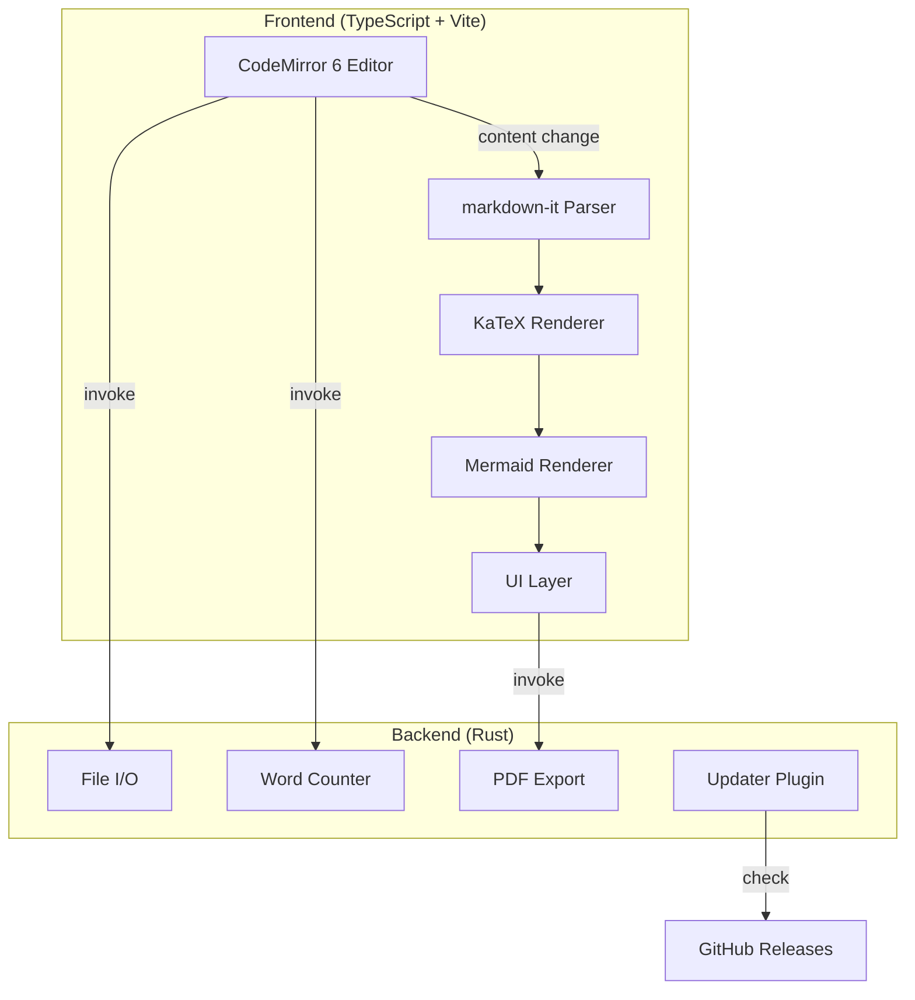

# 00-architecture-overview

mx is a Tauri 2 desktop markdown editor with live preview, Mermaid diagrams, KaTeX math, and word counting. The frontend runs vanilla TypeScript via Vite; the backend runs Rust for file I/O and PDF export.

## System Diagram

## 1. Tech Stack

| Layer | Technology | Purpose |
|-------|-----------|---------|
| Shell | Tauri 2 | Native window, IPC, file access |
| Frontend | Vite + TypeScript | Build tooling, HMR |
| Editor | CodeMirror 6 | Markdown editing |
| Preview | markdown-it + KaTeX + Mermaid | Live HTML rendering |
| Backend | Rust | File ops, word count, PDF export |
| PDF | Pandoc + mermaid.ink | Markdown-to-PDF pipeline |
| Update | tauri-plugin-updater | In-app auto-update via GitHub Releases |
| CI/CD | GitHub Actions | Multi-platform build + release |

## 2. Process Model

Tauri runs two processes: a Rust backend exposing commands via IPC, and a webview frontend on `localhost:1420` during dev. The frontend calls Rust via `invoke()`. No database, no network except optional mermaid.ink for PDF export.

## 3. Entry Points

| Entry | File | Role |
|-------|------|------|
| Rust main | `src-tauri/src/main.rs` | Launches `mx_lib::run()` |
| Rust lib | `src-tauri/src/lib.rs` | All Tauri commands |
| Frontend | `src/main.ts` | Editor init, UI wiring |
| HTML shell | `index.html` | DOM structure |

## File Reference

| File | Purpose |
|------|---------|
| `src-tauri/tauri.conf.json` | Tauri config, window, bundle, CSP |
| `src-tauri/Cargo.toml` | Rust dependencies |
| `package.json` | Frontend dependencies |
| `vite.config.ts` | Vite dev server config |
| `tsconfig.json` | TypeScript compiler options |

## Cross-References

| Doc | Relation |
|-----|----------|
| [01-editor-engine](01-editor-engine.md) | Frontend editor setup |
| [02-preview-pipeline](02-preview-pipeline.md) | Content rendering |
| [03-file-operations](03-file-operations.md) | Rust backend commands |
| [04-pdf-export](04-pdf-export.md) | PDF generation |
| [05-ui-layout](05-ui-layout.md) | UI components |
| [06-auto-update](06-auto-update.md) | In-app update system |
| [07-release-pipeline](07-release-pipeline.md) | CI/CD and release process |
