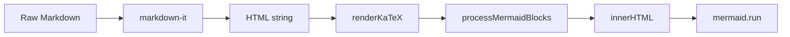

# 02-preview-pipeline

The preview pipeline transforms raw markdown into rendered HTML through three stages: markdown-it parsing, KaTeX math rendering, and Mermaid diagram rendering. Output displays in the preview pane.

## System Diagram

## 1. markdown-it

Configured with `html: true`, `linkify: true`, `typographer: true`. Handles standard markdown, tables, code blocks, blockquotes, lists.

### Heading IDs & Copy-link Button

Two custom renderer rules extend the base instance:

**`heading_open`** — generates a URL-safe `id` on every heading using Unicode-aware slugification:
- Extracts text from `text` and `code_inline` child tokens
- Lowercases and strips non-letter/non-digit chars via `/[^\p{L}\p{N}\s-]/gu` (preserves Vietnamese diacritics and other Unicode scripts)
- Replaces whitespace with `-`
- Example: `## Danh sách Hyperlink` → `id="danh-sách-hyperlink"`

**`heading_close`** — injects `<button class="heading-copy-link" data-anchor="…">¶</button>` before the closing tag. Hidden by default, revealed on heading hover; click copies `#anchor-id` to clipboard.

### Link Click Navigation

The preview pane has a delegated click handler that intercepts all `<a>` clicks (`e.preventDefault()`) and routes them:

| href pattern | Behavior |
|---|---|
| `https?://…` | Opens in system browser via `plugin:opener` |
| `#fragment` | Calls `scrollPreviewToAnchor(fragment)` — scrolls preview to matching `[id]` or `[name]` element |
| `file.md` / `../dir/file.md` | Resolves path via `new URL(filePart, "file://…/")` and calls `openFile()` |
| `file.md#section` | Opens file, flushes debounce, re-renders preview, then scrolls to anchor |

`scrollPreviewToAnchor(fragment)` queries `[id="…"], [name="…"]` — the `name` selector supports explicit `<a name="anchor">` tags inside table cells.

## 2. KaTeX Math

`renderKaTeX()` processes the HTML string with regex replacement:

| Pattern | Mode | Example |
|---------|------|---------|
| `$$...$$` | Display (block) | `$$\int_0^1 x dx$$` |
| `$...$` | Inline | `$E=mc^2$` |

Both use `throwOnError: false` for graceful degradation. Errors render as `<pre>` or `<code>` with class `katex-error`.

## 3. Mermaid Diagrams

Two-phase rendering:

1. `processMermaidBlocks()` — regex replaces `<pre><code class="language-mermaid">` blocks with `
` elements, decoding HTML entities
2. `renderMermaidDivs()` — async call to `mermaid.run()` on all `.mermaid` divs in the preview pane

Mermaid initialized with `startOnLoad: false`, `theme: "dark"`. Render errors are silently caught.

## 4. Render Trigger

`updatePreview()` skips rendering if preview pane is hidden (`display === "none"`). Called on:
- Content change (debounced 300ms)
- View mode switch to split or preview
- Initial load with sample content

## File Reference

| File | Purpose |
|------|---------|
| `src/main.ts:30` | markdown-it instance |
| `src/main.ts:32-46` | `renderKaTeX()` |
| `src/main.ts:54-63` | `processMermaidBlocks()` |
| `src/main.ts:65-71` | `renderMermaidDivs()` |
| `src/main.ts:75-84` | `updatePreview()` orchestrator |

## Cross-References

| Doc | Relation |
|-----|----------|
| [01-editor-engine](01-editor-engine.md) | Triggers preview on content change |
| [05-ui-layout](05-ui-layout.md) | Preview pane display |
| [04-pdf-export](04-pdf-export.md) | Separate Mermaid rendering for PDF |
