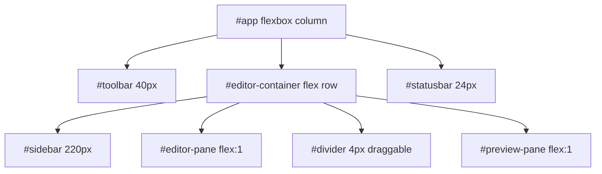

# 05-ui-layout

The UI has four zones: toolbar, sidebar, editor container (editor + divider + preview), and status bar. Catppuccin Mocha dark theme throughout. Layout is pure CSS flexbox.

## System Diagram

## 1. Toolbar

| Element | ID | Content |
|---------|-----|---------|
| File name | `#filename` | Current file or "No file open" |
| Modified dot | `#modified-indicator` | Orange `●` when unsaved |
| Dropdown menus | `.toolbar-dropdown` | File ▾, View ▾, Help ▾ |
| Copy button | `#btn-copy-html` | Copy formatted HTML |
| Zoom controls | `#btn-zoom-out`, `#status-zoom`, `#btn-zoom-in` | − 100% + |
| Stats | `#token-info` | Word count + line count |

### Dropdown Menus

| Menu | Items |
|------|-------|
| File ▾ | Open File (⌘O), Open Folder, Recent Files, Save (⌘S), Export PDF |
| View ▾ | Toggle Sidebar (⌘B), Toggle Preview (⌘P), Read Mode (⌘E) |
| Help ▾ | Check for Updates..., About mx |

## 2. View Modes

| Mode | Editor | Divider | Preview | Trigger |
|------|--------|---------|---------|---------|
| split | visible | visible | visible | Default, `Cmd+P` toggle |
| editor | 100% | hidden | hidden | `Cmd+P` from split |
| preview | hidden | hidden | 100% | `Cmd+E` |

## 3. Sidebar

Flat file browser, 220px wide. Shows directory entries with emoji icons by extension. Directories first, alphabetical sort. Parent `..` entry for navigation. Toggle with `Cmd+B`.

| Extension | Icon |
|-----------|------|
| directory | `📁` |
| `.md` | `📝` |
| `.json` | `{}` |
| `.ts`/`.js` | `⚡` |
| `.rs` | `🦀` |
| `.css` | `🎨` |
| other | `📄` |

## 4. Divider Drag

Mouse-drag on `#divider` resizes editor/preview split. Clamped to 20%-80% range. Uses `mousedown`/`mousemove`/`mouseup` with cursor override.

## 5. Status Bar

| Element | ID | Content |
|---------|-----|---------|
| Cursor | `#status-position` | `Ln N, Col N` |
| Words | `#status-words` | Word count |
| Chars | `#status-tokens` | Character count |

## 6. Theme Variables

| Variable | Value | Purpose |
|----------|-------|---------|
| `--bg` | `#1e1e2e` | Background |
| `--surface` | `#252536` | Toolbar, sidebar, code blocks |
| `--border` | `#333348` | Borders |
| `--text` | `#cdd6f4` | Body text |
| `--accent` | `#89b4fa` | Links, active items |
| `--warning` | `#fab387` | Modified indicator |
| `--muted` | `#6c7086` | Secondary text |

## File Reference

| File | Purpose |
|------|---------|
| `index.html` | DOM structure |
| `src/styles.css` | All styles |
| `src/main.ts:227-269` | View mode switching |
| `src/main.ts:192-225` | Divider drag logic |
| `src/main.ts:448-542` | Sidebar / file tree |

## Cross-References

| Doc | Relation |
|-----|----------|
| [01-editor-engine](01-editor-engine.md) | Editor pane content |
| [02-preview-pipeline](02-preview-pipeline.md) | Preview pane content |
| [03-file-operations](03-file-operations.md) | Sidebar file browsing |
| [06-auto-update](06-auto-update.md) | Help menu update check |
