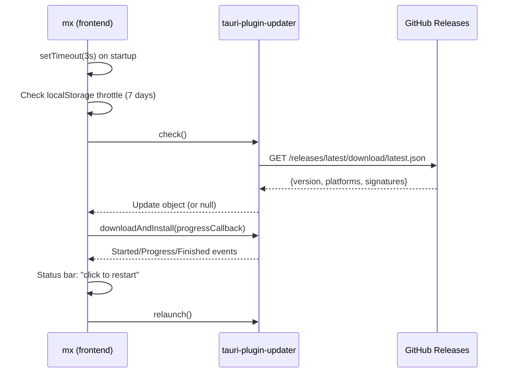

# 06-auto-update

In-app auto-update via `tauri-plugin-updater`. Checks GitHub Releases for `latest.json` weekly, downloads and installs updates in background, prompts user to restart.

## System Diagram

## 1. Configuration

| Config | Location | Value |
|--------|----------|-------|
| Endpoint | `tauri.conf.json` plugins.updater.endpoints | `https://github.com/vibery-studio/mx/releases/latest/download/latest.json` |
| Public key | `tauri.conf.json` plugins.updater.pubkey | Ed25519 base64 |
| Bundle artifacts | `tauri.conf.json` bundle.createUpdaterArtifacts | `true` |
| Capabilities | `capabilities/default.json` | `updater:default`, `process:allow-restart` |

## 2. Rust Plugin Registration

Registered in `lib.rs` via `.setup()` with `#[cfg(desktop)]` guard. Also requires `tauri-plugin-process` for `relaunch()`.

## 3. Frontend Logic

| Behavior | Detail |
|----------|--------|
| Auto check | 3s after DOMContentLoaded |
| Throttle | Once per 7 days via `localStorage("mx-update-last-check")` |
| Manual check | Help menu > "Check for Updates..." (bypasses throttle) |
| Progress | Status bar shows download percentage |
| Install prompt | "Update installed — click to restart" |
| Error handling | Silent on auto-check, status bar message on manual |

## 4. Signing

| Key | Location |
|-----|----------|
| Private key | GitHub secret `TAURI_SIGNING_PRIVATE_KEY` |
| Password | GitHub secret `TAURI_SIGNING_PRIVATE_KEY_PASSWORD` (empty) |
| Public key | `tauri.conf.json` plugins.updater.pubkey |
| Local backup | `~/.tauri/mx.key` |

## 5. Updater Artifacts per Platform

| Platform | Updater bundle | Signature |
|----------|---------------|-----------|
| macOS | `mx.app.tar.gz` | `mx.app.tar.gz.sig` |
| Linux | `mx_X.Y.Z_amd64.AppImage` | `*.AppImage.sig` |
| Windows | `mx_X.Y.Z_x64-setup.exe` | `*-setup.exe.sig` |

## File Reference

| File | Purpose |
|------|---------|
| `src/main.ts:711-772` | `doUpdateCheck()`, `checkForUpdates()` |
| `src-tauri/src/lib.rs:243-247` | Plugin registration |
| `src-tauri/tauri.conf.json:26-32` | Updater config |
| `src-tauri/capabilities/default.json` | Permissions |

## Cross-References

| Doc | Relation |
|-----|----------|
| [00-architecture-overview](00-architecture-overview.md) | System context |
| [05-ui-layout](05-ui-layout.md) | Help menu, status bar |
| [07-release-pipeline](07-release-pipeline.md) | Generates latest.json + signatures |
