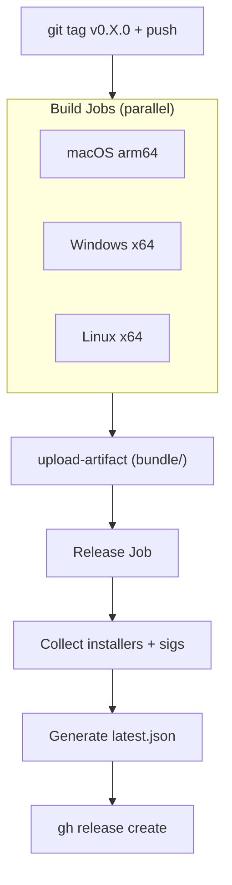

# 07-release-pipeline

GitHub Actions CI/CD builds mx for 3 platforms on tag push, generates signed updater artifacts, and creates a GitHub Release with `latest.json` for auto-update.

## System Diagram



## 1. Trigger

Tag push matching `v*` pattern. Workflow: `.github/workflows/release.yml`.

## 2. Build Matrix

| Platform | Runner | Target | Installers | Updater bundle |
|----------|--------|--------|-----------|----------------|
| macOS | `macos-latest` | `aarch64-apple-darwin` | `.dmg` | `.app.tar.gz` + `.sig` |
| Windows | `windows-latest` | `x86_64-pc-windows-msvc` | `.msi`, `.exe` | `-setup.exe` + `.sig` |
| Linux | `ubuntu-22.04` | `x86_64-unknown-linux-gnu` | `.deb`, `.rpm`, `.AppImage` | `.AppImage` + `.sig` |

## 3. Build Steps per Platform

1. `actions/checkout@v4`
2. `actions/setup-node@v4` (Node 20)
3. `dtolnay/rust-toolchain@stable` with target
4. Linux: install webkit2gtk, appindicator, librsvg, patchelf
5. `npm ci`
6. `npx tauri build --target $TARGET` with signing env vars
7. `actions/upload-artifact@v4` (entire `bundle/` directory)

## 4. Release Job

Runs after all builds complete:
1. Download all artifacts via `download-artifact@v4` with `merge-multiple: true`
2. Collect installers and `.sig` files into `release-files/`
3. Read signatures from `.sig` files per platform
4. Generate `latest.json` with version, pub_date, per-platform URLs + signatures
5. `gh release create` with all files

## 5. latest.json Schema

```json
{
  "version": "X.Y.Z",
  "notes": "mx vX.Y.Z",
  "pub_date": "ISO8601",
  "platforms": {
    "darwin-aarch64": { "signature": "base64", "url": "https://...tar.gz" },
    "linux-x86_64": { "signature": "base64", "url": "https://...AppImage" },
    "windows-x86_64": { "signature": "base64", "url": "https://...exe" }
  }
}
```

## 6. Signing Environment

| Secret | Purpose |
|--------|---------|
| `TAURI_SIGNING_PRIVATE_KEY` | Ed25519 private key for artifact signing |
| `TAURI_SIGNING_PRIVATE_KEY_PASSWORD` | Key password (empty) |
| `GITHUB_TOKEN` | Auto-provided, release creation |

## 7. Release Process

```bash
# 1. Bump version in 3 files
# package.json, src-tauri/Cargo.toml, src-tauri/tauri.conf.json

# 2. Commit and tag
git commit -am "Bump version to X.Y.Z"
git tag vX.Y.Z
git push origin main && git push origin vX.Y.Z
```

## File Reference

| File | Purpose |
|------|---------|
| `.github/workflows/release.yml` | Full CI/CD workflow |
| `src-tauri/tauri.conf.json:34-36` | `createUpdaterArtifacts: true` |

## Cross-References

| Doc | Relation |
|-----|----------|
| [06-auto-update](06-auto-update.md) | Consumes latest.json |
| [00-architecture-overview](00-architecture-overview.md) | System context |
